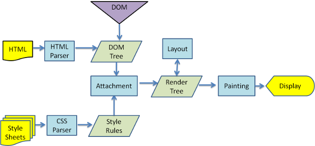

# 浏览器渲染流程

以 chrome 为例，其渲染流程如下

### 1. 解析 HTML，构建 DOM 树

解析过程为`Bytes -> characters -> tokens -> nodes -> object model`

并且会在当前节点的所有子节点都构建完毕后才回去构建当前节点的下一个兄弟节点

`注：遇到外链的话，会在此步发送请求`

### 2. 解析 CSS，生成 CSSOM

解析过程为`Bytes -> characters -> tokens -> nodes -> object model`

`注：很多浏览器都有自己的默认样式表，很多时候CSSOM都只是对这张默认样式表部分的替换`

### 3. 合并DOM树和CSSOM，生成渲染树(render Tree)

DOM树从根节点开始遍历可见节点，保存各个节点的样式信息及其余节点的从属关系

### 4. 布局渲染树(Layout/Reflow)

计算各元素的大小和位置

### 5. 绘制渲染树(Paint)

绘制页面像素信息

### 6. 合成(Componsite)

浏览器将各层的信息发给GPU，GPU将各层合成（Composite），显示在屏幕上
